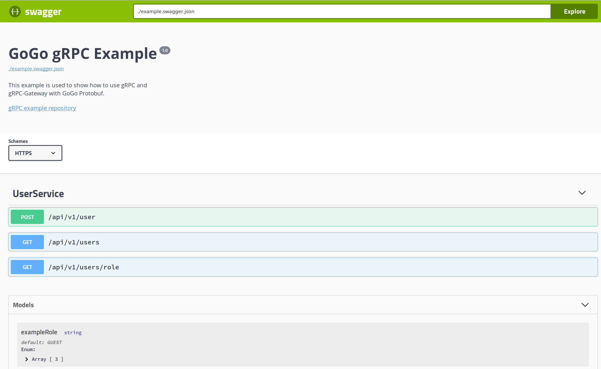

# gRPC-Example

This repo is an example of using [Go gRPC](https://github.com/grpc/grpc-go)
and tools from the greater gRPC ecosystem together with  the
[GoGo Protobuf Project](https://github.com/gogo/protobuf).



## Installation

```bash
$ go get -u github.com/gogo/grpc-example
```

## Running it

```bash
$ grpc-example
INFO: Serving gRPC on https://localhost:10000
INFO: dialing to target with scheme: "ipv4"
INFO: ccResolverWrapper: sending new addresses to cc: [{localhost:10000 0  <nil>}]
INFO: ClientConn switching balancer to "pick_first"
INFO: pickfirstBalancer: HandleSubConnStateChange: 0xc420097c00, CONNECTING
INFO: pickfirstBalancer: HandleSubConnStateChange: 0xc420097c00, READY
INFO: Serving gRPC-Gateway on https://localhost:11000
INFO: Serving OpenAPI Documentation on https://localhost:11000/openapi-ui/
```

After starting the server, you can access the OpenAPI UI on
[https://localhost:11000/openapi-ui/](https://localhost:11000/openapi-ui/)

## Development

To regenerate the proto files, ensure you have installed the generate dependencies:

```bash
$ make install
go install \
        ./vendor/github.com/gogo/protobuf/protoc-gen-gogo \
        ./vendor/github.com/grpc-ecosystem/grpc-gateway/protoc-gen-grpc-gateway \
        ./vendor/github.com/grpc-ecosystem/grpc-gateway/protoc-gen-swagger \
        ./vendor/github.com/mwitkow/go-proto-validators/protoc-gen-govalidators
```

It also requires you to have the Google Protobuf compiler `protoc` installed.
Please follow instructions for your platform on the
[official protoc repo](https://github.com/google/protobuf#protocol-compiler-installation).

Regenerate the files by running `make generate`:

```bash
$ make generate
# Generate gogo, gRPC-Gateway, swagger, go-validators output.
#
# -I declares import folders, in order of importance
# This is how proto resolves the protofile imports.
# It will check for the protofile relative to each of these
# folders and use the first one it finds.
#
# --gogo_out generates GoGo Protobuf output with gRPC plugin enabled.
# --grpc-gateway_out generates gRPC-Gateway output.
# --swagger_out generates an OpenAPI 2.0 specification for our gRPC-Gateway endpoints.
# --govalidators_out generates Go validation files for our messages types, if specified.
#
# The lines starting with Mgoogle/... are proto import replacements,
# which cause the generated file to import the specified packages
# instead of the go_package's declared by the imported protof files.
#
# $GOPATH/src is the output directory. It is relative to the GOPATH/src directory
# since we've specified a go_package option relative to that directory.
#
# proto/example.proto is the location of the protofile we use.
protoc \
        -I proto \
        -I vendor/github.com/grpc-ecosystem/grpc-gateway/ \
        -I vendor/github.com/gogo/googleapis/ \
        -I vendor/ \
        --gogo_out=plugins=grpc,\
Mgoogle/protobuf/timestamp.proto=github.com/gogo/protobuf/types,\
Mgoogle/protobuf/empty.proto=github.com/gogo/protobuf/types,\
Mgoogle/api/annotations.proto=github.com/gogo/googleapis/google/api:\
$GOPATH/src/ \
        --grpc-gateway_out=\
Mgoogle/protobuf/timestamp.proto=github.com/gogo/protobuf/types,\
Mgoogle/protobuf/empty.proto=github.com/gogo/protobuf/types,\
Mgoogle/api/annotations.proto=github.com/gogo/googleapis/google/api:\
$GOPATH/src/ \
        --swagger_out=third_party/OpenAPI/ \
        --govalidators_out=gogoimport=true,\
Mgoogle/protobuf/timestamp.proto=github.com/gogo/protobuf/types,\
Mgoogle/protobuf/empty.proto=github.com/gogo/protobuf/types,\
Mgoogle/api/annotations.proto=github.com/gogo/googleapis/google/api:\
$GOPATH/src \
        proto/example.proto
# Workaround for https://github.com/grpc-ecosystem/grpc-gateway/issues/229.
sed -i "s/empty.Empty/types.Empty/g" proto/example.pb.gw.go
# Generate static assets for OpenAPI UI
cd static && go run generate.go
writing static.go
```
